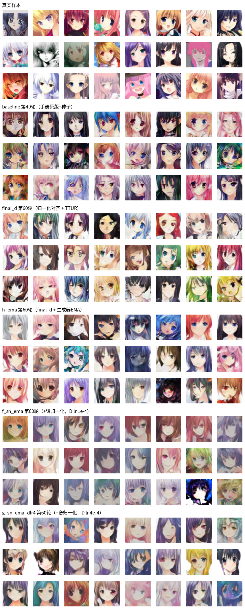
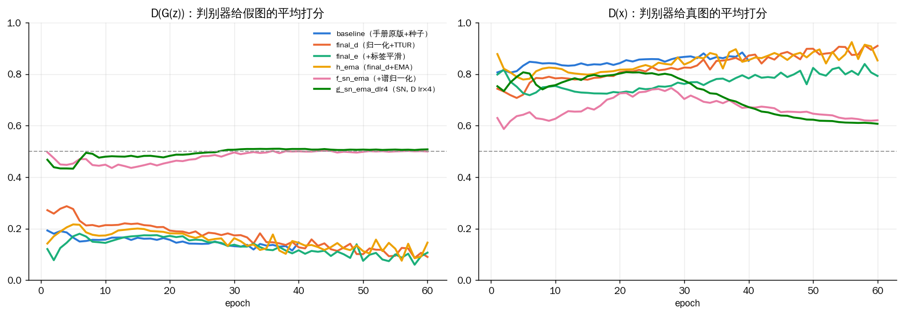

# 基于 MindSpore 的 DCGAN 生成漫画头像 —— 复现与优化

> 机器视觉课程大作业 | MindSpore 2.6 · DCGAN · GPU（WSL2 / Ubuntu）

## 项目简介

以华为《基于 MindSpore 的 DCGAN 生成漫画头像实验手册》为起点，先完成复现，再对原版代码做审查、修复与一系列消融实验，目标是弄清楚"效果为什么不好、改什么才有用"。

一句话结论：**最主要的提升来自修正原版代码的正确性问题（数据归一化与 Tanh 值域不匹配），超参调优只改善博弈指标、对图像质量的可见影响有限；判别器谱归一化是一个完整的负结果。** 详细分析见 [`实验总结.md`](实验总结.md)。

- 数据集：漫画头像 `faces.zip`（手册提供，`download/` 目录，不入库）
- 最终模型：`runs/final_d`（归一化对齐 + TTUR，60 轮），出图版本可用 `runs/h_ema`（同配置 + 生成器 EMA）

---

## 目录结构

```
DCGAN/
├── README.md                                   # 本文件
├── 实验总结.md                                  # 全部实验的矩阵、指标、结论、图表清单、参考文献 ★
├── 代码审查与优化清单.md                          # 对手册原版代码的问题定位与改进方案
├── WSL2_GPU环境搭建.md                          # 在 WSL2 里让 MindSpore 用上 N 卡的步骤
├── ai-log.md                                   # AI 协作记录
├── 基于MindSpore的DCGAN生成漫画头像实验手册.docx  # 原始实验手册
├── 华为云ModelArts.docx
│
├── code/
│   ├── train_dcgan.py            # 手册原版训练脚本（保留作对照，CPU）
│   ├── train_dcgan_v3.py         # 改进版训练脚本，所有实验用它跑 ★
│   ├── sample_truncated.py       # 从 ckpt 出图 / 截断采样（不重训）
│   ├── monitor.py                # 训练实时监控页面
│   ├── make_gif.py               # 由逐轮生成图合成 GIF
│   └── training_demo.html        # 训练过程动态演示页面
│
├── runs/                         # 每组实验一个目录（ckpt 不入库）
│   ├── original/                 # 手册原版跑出的结果（无种子，仅参照）
│   ├── baseline/  a_norm/  b_smooth/  c_flip/  d_ttur/  e_both/
│   ├── final_d/  final_e/  h_ema/  f_sn_ema/  g_sn_ema_dlr4/
│   └── <每组>/ config.json  metrics.csv  curve_loss.png  curve_d_output.png
│                generated_epoch{N}.png  latent_interpolation.png  sample_real.png
│
└── report_assets/                # 报告用图：总览拼图、六组 D 输出曲线、各轮对比图
```

---

## 快速开始

### 环境

MindSpore 的 Windows 包没有 GPU 后端；本项目在 WSL2 + Ubuntu 下用 GPU 训练，配置步骤见 `WSL2_GPU环境搭建.md`。只想跑通流程的话 CPU 也行（`--device CPU`，每轮约慢一个数量级）。

```bash
conda create -n ms python=3.9 -y && conda activate ms
pip install mindspore==2.6.0 matplotlib numpy
```

### 复现最终模型（final_d）

```bash
python code/train_dcgan_v3.py --data ~/dcgan_data --out runs/final_d --tag final_d \
    --graph-mode --norm pm1 --d-lr 1e-4 --epochs 60
```

`--data` 指向一个目录，其下有一个子目录装着全部 jpg（`ImageFolderDataset` 的要求）。
加 `--ema 0.999` 即为 `h_ema` 配置，会额外输出 `generator_ema.ckpt` 与 EMA 权重的生成图。

### 手册原版对照组（baseline）

```bash
python code/train_dcgan_v3.py --data ~/dcgan_data --out runs/baseline --tag baseline \
    --graph-mode --epochs 40
```

不加任何开关时，v3 的网络、损失、优化器与手册原版一致，只多了随机种子、固定噪声与指标记录。

### 从 ckpt 出图 / 截断采样

```bash
python code/sample_truncated.py --ckpt runs/final_d/generator.ckpt --out runs/final_d/trunc \
    --psi 1.0 0.8 0.7 0.5
```

### 训练监控

```bash
python code/monitor.py --dir runs/final_d --epochs 60     # 浏览器打开 http://localhost:8765
```

---

## `train_dcgan_v3.py` 的开关

每一项都可独立开关，默认关闭即等价于手册原版（加种子）。

| 开关 | 作用 | 对应实验 |
|---|---|---|
| `--norm pm1` | 数据归一化到 [-1,1]，与生成器 Tanh 对齐（原版是 [0,1]，值域不匹配） | a_norm 起全部 |
| `--label-smooth 0.9` | 单边标签平滑，压低判别器自信 | b, c, e, final_e |
| `--flip` | 随机水平翻转增强 | c_flip |
| `--d-lr 1e-4` | 判别器单独学习率（TTUR） | d, e, final_*, h, f |
| `--ema 0.999` | 生成器权重滑动平均，用 EMA 权重出图与存盘 | h, f, g |
| `--sn` | 判别器卷积层谱归一化，并去掉 D 的 BatchNorm | f, g |
| `--logits` | 判别器输出 logits，改用 BCEWithLogitsLoss | 未在最终实验中启用 |
| `--resume` | 断点续训（含优化器状态） | — |

其它固定设置：batch 128、64×64、nz 100、ngf = ndf = 64、Adam(lr 2e-4, β1 0.5)、seed 1。

---

## 实验结果一览

D(x) 为判别器给真图的平均打分，D(G(z)) 为给假图的平均打分；理想博弈两者都趋向 0.5。

| 实验 | 改动 | 轮数 | D(x) | D(G(z)) | 一句话结论 |
|---|---|---|---|---|---|
| baseline | 手册原版 + 种子 | 40 | 0.85 | 0.15 | D 全程压倒 G，与手册"达到平衡"的说法不符 |
| a_norm | + 归一化对齐 | 15 | 0.85 | 0.15 | 指标不动，但色块伪影明显减少 —— loss 不能衡量 GAN 质量 |
| b_smooth | + 标签平滑 | 15 | 0.75 | 0.15 | 压低了 D 的自信，对 G 无明显帮助 |
| c_flip | + 翻转增强 | 15 | 0.75 | 0.15 | 与 b 几乎一致，无可见收益 |
| d_ttur | + TTUR | 15 | 0.78 | 0.22 | 15 轮消融中最接近平衡 |
| e_both | 标签平滑 + TTUR | 15 | 0.71 | 0.18 | 介于两者之间 |
| **final_d** | d_ttur 跑满 | 60 | 0.91 | 0.09 | **最终模型**；但 D 在 40 轮后重新压倒 G |
| final_e | e_both 跑满 | 60 | 0.79 | 0.11 | 与 final_d 肉眼持平 |
| h_ema | final_d + EMA | 60 | 0.85 | 0.15 | EMA 权重出图比原始权重明显少噪点 |
| f_sn_ema | + 谱归一化 | 60 | 0.62 | 0.50 | D 从过强翻到过弱，中段模式坍塌，负结果 |
| g_sn_ema_dlr4 | 同上，D lr ×4 | 60 | 0.61 | 0.51 | 与 f 曲线重合：瓶颈不在学习率 |





要点：

1. 归一化修复（a_norm）是视觉上最大的一步提升，但 D(x)/D(G(z)) 几乎不变——**GAN 的 loss 与判别器打分不能直接衡量图像质量**，评估必须看图（或 FID）。
2. 标签平滑、TTUR 只改善博弈指标；TTUR 推迟但没有根治 D 压制，final_d 在第 40 轮后 D(G(z)) 又回落到 baseline 水平。
3. 11 组实验的 D(G(z)) 只有两种归宿：贴在 0.1~0.2（D 过强），或贴在 0.5（D 过弱，两组 SN）。没有一组真正落在中间——单个手段只能把博弈从一个极端推向另一个极端。
4. 谱归一化的负结果：Miyato 等 2018 年（SN-GAN）的配方是 SN + hinge 损失 + 每步多次更新 D + Adam β1=0，本项目只移植了 SN 一项，D 的判别能力被限制在天花板之下，且对学习率不敏感。
5. 未解决的短板是眼睛等精细结构，属于生成器架构问题（转置卷积棋盘格伪影、缺少全局一致性），不是博弈平衡能解决的；留作未来工作（上采样 + 卷积替换转置卷积、自注意力、DiffAugment、FID 评估）。

---

## 相对手册原版的代码改动

| 类别 | 改动 |
|---|---|
| 正确性 | 数据归一化对齐 Tanh；`fixed_noise` 移出训练循环只采样一次；补随机种子 |
| 工程 | 删除累积 250MB 的 `image_list`（疑似原版第 41 轮崩溃原因）；每轮落盘 `metrics.csv`；断点续训；argparse 参数化，去掉硬编码路径 |
| 评估 | 记录 D(x) / D(G(z)) 曲线；训练结束自动生成隐空间插值图；`sample_truncated.py` 支持截断采样 |
| 可选改进 | 单边标签平滑、TTUR、水平翻转、BCEWithLogits、生成器 EMA、判别器谱归一化（自行实现 `SNConv2d`） |

---

## 参考文献

- Radford, Metz, Chintala. *Unsupervised Representation Learning with Deep Convolutional GANs.* ICLR 2016.
- Salimans et al. *Improved Techniques for Training GANs.* NeurIPS 2016.（单边标签平滑）
- Heusel et al. *GANs Trained by a Two Time-Scale Update Rule Converge to a Local Nash Equilibrium.* NeurIPS 2017.（TTUR、FID）
- Miyato et al. *Spectral Normalization for Generative Adversarial Networks.* ICLR 2018.
- Karras et al. *Progressive Growing of GANs for Improved Quality, Stability, and Variation.* ICLR 2018.（生成器 EMA）
- Brock, Donahue, Simonyan. *Large Scale GAN Training for High Fidelity Natural Image Synthesis.* ICLR 2019.（截断技巧）
- Odena, Dumoulin, Olah. *Deconvolution and Checkerboard Artifacts.* Distill 2016.
